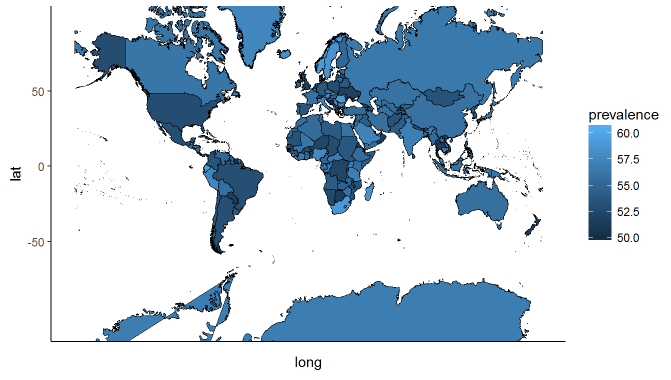

----------------------------------------------------------------------------

## Quick notes and references:
http://stackoverflow.com/questions/27998283/paint-some-designated-countries-in-world-map-using-ggmap
http://stackoverflow.com/questions/22625119/choropleth-world-map
http://rforpublichealth.blogspot.com/2015/10/mapping-with-ggplot-create-nice.html
I used this shapefile: http://thematicmapping.org/downloads/world_borders.php
    
## Load our libraries
    
```{r libs, echo=FALSE}
# install.packages("gpclib", type = "source")
library(maptools)
library(ggplot2)
library(rgeos)
library(mapproj)
#library(gpclib)
```
    
    
## 1) read in shapefile

The first step is to download a shapefile. As I mentioned in the notes, I downloaded my shapefile from (thematic mapping)[http://thematicmapping.org/downloads/world_borders.php], but there are multiple places that offer these.


```{r read_shapefile}
#setwd('C:/users/tvananne/downloads')
setwd('C:/users/Taylor/Downloads')

my_shp <- maptools::readShapeSpatial('TM_WORLD_BORDERS-0.3.shp')    

    
        # # inspect
        # names(my_shp)
        # print(my_shp$NAME)
        # head(my_shp)
        # class(my_shp)
```


## 2) activate permit -- build to a dataframe

maptools warns that eventually **maptools::gpclibPermit** will no longer be available. I am not sure what to do at that point, but for now, this works.

```{r fortify}

    maptools::gpclibPermit()
    my_shp.f <- fortify(my_shp, region = "ISO3")
    
            # can do same thing in tidy (and also in broom)
            # my_shp.f <- tidy(my_shp)
            # my_shp.f2 <- tidy(my_shp, region = 'ISO3')
```   
    
## 3) Merge data into shapefile

This is where we would join in our data to the shapefile. There are better ways to do this now with tibbles and nested dataframes using the **purrr** package and the rest of the **"tidyverse"** packages. That is definitely worth looking into, but the point of this example is to get us up and running with a map-chart chloropleth as quickly as possible.

```{r merge_data}
    length(unique(my_shp.f$id))
    mydata <- data.frame(id=unique(my_shp.f$id), prevalence=rnorm(246, 55, 2))
    final_data <- merge(my_shp.f, mydata, by='id', all=T)
```
    
    
## 4) Plot: it lives!

So now we have merged our country-dimension data into the shapefile and are ready to plot with **ggplot2**.

```{r plot_it}
    ggplot() +
        geom_polygon(data = final_data, 
                     aes(x = long, y = lat, group = group, fill = prevalence),
                     color='black', size = 0.25) +
            coord_map() +
        theme_classic()
    
    sapply(final_data, class)
```
    

    
    
    
## NOTES: (this was a comment)

I need to figure out who to attribute the credit of this comment to, but essentially it is better to use **readOGR** form **rgdal** package because it works with more coordinate systems than just lat-long.

> Don't use `readShapeSpatial` because it doesn't read the projection info. Always use `readOGR` from the `rgdal`package or `shapefile` from the `raster` package. Its not a problem if all you ever use is lat-long, but once you start getting data in other coordinate systems or want to make web maps things will break...
```
